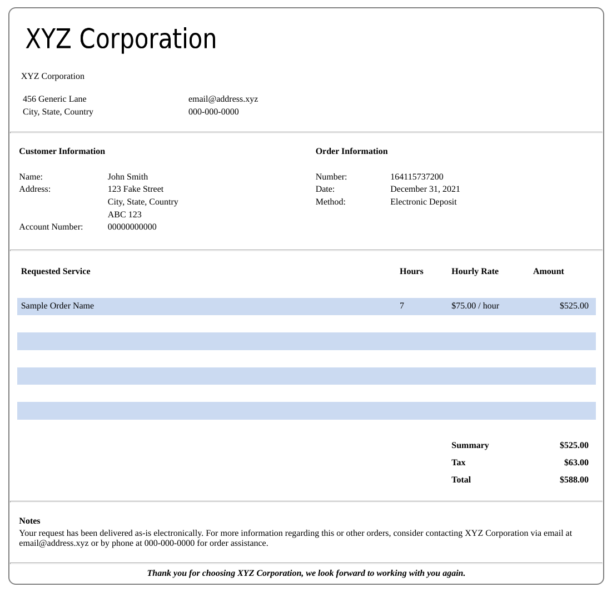

# HTML invoice generator written in Python

This humble python-based CLI tool produces simple yet clean invoices,
as denoted in the picture below:



One of the advantages over other methods is that the end-user can
redirect the output of the script using whatever commandline tools
preferred.

# Requirements

Specifically, the following packages are required:

* python-3 

# Installation

Install generate_invoice.py at the location your typical python scripts.

Afterwards, adjust the details and to match your company and client so that
the HTML generated resembles what orders you need to place / deliver.

The script calls pycss.py to generate the CSS for the HTML file. You may
have to edit pycss.py if the styles need to be adjusted.

# Usage

Commandline options include:

```
generate_invoice.py -n -d <date> -o <file>
-n    No Taxes   (optional) Do not calculate taxes
-d    Date       e.g. December 31, 2021
-o    Output     e.g. /tmp/sample_invoice.html
```

Simply execute the script and redirect the contents to the intended
destination (e.g. HTML file or email).

To make an HTML invoice file:

```bash
./generate_invoice.py -d "December 31, 2021" -o /path/to/biz_invoice.html
```

Where `-d` is the datetime and `-o` is the filename you wish to save it to.

To send an email of the invoice, attach the file using an email client of
your choice:

```bash
sendmail customer@domain.com < /path/to/biz_invoice.html
```

# Author

This was developed by Robert Bisewski at Ibis Cybernetics. For more information, visit our website at:

https://www.ibiscybernetics.com

Alternative, send an email to the following address, and we'll help you if we can:

contact@ibiscybernetics.com